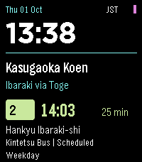

# KasugaBus

<!-- kasugabus-release-status -->
KasugaBus **v1.0.0** is an interactive Pebble Time 2 (`emery`) app. The unpublished local build, including the selected Neon Express launcher icon, is installed on the owner's watch. Broader phone/watch release checks remain pending.

A large clock and one scheduled departure form the Neon Transit home screen. The departure board, full details, favourites, all-stop picker, Nearby, trip context and data status work through the watch buttons. Timetables run offline; phone location, Clay settings and timetable downloads add optional connected functions.



[GitHub releases](https://github.com/ewijaya/kasugabus-pebble/releases) · [Verification and exact digest](docs/VERIFICATION.md) · [Native screenshots](artifacts/screenshots/README.md) · [Ten launcher-icon concepts](artifacts/icon-options/index.html)

The validated baseline contains **1,411 departures at 15 boarding points across six stop groups**: Kasugaoka Koen, Toge, Midorigaoka, Handai Higashiguchi, Handai Igakubu Byoin-mae and Handai Igakubu-mae. Kintetsu and Hankyu operators, boarded route numbers, directions and calendars remain separate. Service coverage is **1 October–27 December 2026**. Later dates are unconfirmed pending year-end source review. Source verification is dated 1 October; the next full review is due 1 November.

Nearby ranks the **six verified Hankyu poles**. Kintetsu poles remain available manually; their coordinates were not sufficiently verified. Distances are approximate straight-line distances, never walking times or roadside guidance. The app shows scheduled departures, not live arrivals.

## Use

- **Home:** Up/Down cycle saved favourites; Select opens the board; Back exits.
- **Hold Select:** Stops, Trip context, Data status and Settings. The board also has a regular Stops & tools row, so holding is optional for stop selection.
- **Lists:** Up/Down choose; Select opens; Back returns. Details and Data status scroll.
- **Nearby:** requests one phone fix on entry or explicit refresh. Manual stop selection always works.
- **Saved origin:** leave-by appears only after a per-boarding-point walking time is configured. General/Nearby and At stop do not reuse it.
- **Data status:** Select checks the timetable feed. Source verification, review date, successful feed check and pending effective date are separate.
- **Companion app settings:** favourite order/default, walking allowances/buffer, optional Nearby startup, display preferences and automatic checks use Clay.

Bus calculations and service dates always use JST. The large clock follows the watch's local zone and 12/24-hour preference. A departure remains Due for its entire scheduled minute. Temporary day-type overrides expire at the next JST date change; they cannot validate expired operator coverage.

## Build and install

The implementation was built on this Mac with Pebble Tool **5.0.40**, SDK **4.33.1**, its bundled ARM GCC **14.2.1**, Python **3.13.5**, Node **26.8.1**, npm **11.19.0**, and `@rebble/clay` **1.1.0**. The existing installed Clay package was reused; the lockfile pins the registry package integrity. Do not install another SDK or replace the compiler to build this project.

```sh
cd /Users/e_wijaya_ap/Desktop/kasugabus-pebble
npm ci --ignore-scripts
npm run generate
python3 scripts/test.py
pebble build
pebble install --emulator emery build/kasugabus-pebble.pbw
```

The SDK lives under `~/Library/Application Support/Pebble SDK/SDKs/4.33.1/`. Its `pebble` wrapper selects the bundled compiler; a separate `arm-none-eabi-gcc` on PATH is unnecessary. The SDK's known RWX linker warning is not a build failure.

The owner's Poco F4 developer connection successfully installed the exact PBW with:

```sh
pebble install --cloudpebble artifacts/KasugaBus-1.0.0-emery.pbw
```

Enable **Dev Connection** in the companion first. Other setups can use the installed CLI's `--phone PHONE_IP` option; inspect `pebble install --help` for the available transports. The app UUID is `d7ba77b0-d528-4cc8-b35c-7052798152c9`; it is an app, not a watchface.

Source extraction additionally uses the pinned packages in `data/requirements-extraction.txt`; normal builds and host tests consume the preserved extraction artifacts and do not require re-extraction.

## Timetable maintenance and releases

- [Source evidence and reconciliation](docs/DATA_RECONCILIATION.md), [editable dataset](data/timetable.json), and [audit proof](data/reconciliation.json).
- [Timetable publishing](docs/PUBLISHING.md) covers immutable payloads, the review gate, current/future manifests and the controlled feed tests. Timetable release numbers are independent of the app version.
- [App release workflow](docs/releasing.md) freezes and publishes one physically approved PBW. The [project release skill](.agents/skills/kasugabus-publish-release/SKILL.md) coordinates it.
- [Verification report](docs/VERIFICATION.md) and [platform/storage decisions](docs/PLATFORM.md) distinguish measured evidence from release checks still outstanding.

The production timetable feed is live on **GitHub Pages**: `https://ewijaya.github.io/kasugabus-pebble/timetables/manifest.json`. HTTPS, exact payload hashes, content types and cross-origin headers were verified on 1 October 2026. Pages uses a ten-minute cache, so a newly published revision may take that long to appear. Timetable-only releases use this fixed endpoint without reinstalling the PBW. [Hosting evidence and procedure](hosting/README.md) distinguish host checks from actual phone behavior.

The source repository is [ewijaya/kasugabus-pebble](https://github.com/ewijaya/kasugabus-pebble). The owner authorized initial publication on 1 October 2026 with the remaining physical and seven-day checks stated as limitations. KasugaBus is **not registered** in the RePebble App Store. The workflow now prepares a complete [initial listing](docs/releases/listing-preview.html), discovers any existing UUID/repository match, and journals first registration through Dashboard New after exact-PBW approval. Its assigned store App ID is separate from the package UUID; both ID and public URL remain unset until verified registration.

## Release checks still required

Physical installation and Home → board → details readability/Select navigation are confirmed on **Time 2 v4.38.4**, **Poco F4 / Android 14 (UKQ1.231207.002)** and **Pebble companion 1.14.0.1**. The owner also confirmed a timetable-only update to v2 with a successful feed-check time. Actual GPS/permission behavior, Clay settings/persistence, physical connection loss and updater recovery, sunlight/glance testing, battery impact and seven days of use including a weekend remain unperformed. The production feed is live; store publication and final exact-candidate approval are being prepared.

The owner selected **1 — Neon Express** from the ten preserved concepts. Its transparent 25 × 25 bus icon is integrated, audited and installed; the owner confirmed it on the preceding package. The preceding development PBW is 817,565 bytes, SHA-256 `2bddb0b092d51c7cdab6944c56a11bb377f4a97932643ee37541450bfc8bdb09`, and was also installed successfully. Its fresh audit includes 113 Python tests and native update/recovery checks. Application code, phone JavaScript and resources are identical to the owner-confirmed icon package. The verification report keeps physical observations bound to their original digests. Version 1.0.0 is retained for the initial release. Final publication uses one separately frozen and physically approved candidate.
