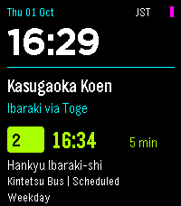

# KasugaBus

<!-- kasugabus-release-status -->
KasugaBus **v2.0.1** for Emery is available from [GitHub Releases](https://github.com/ewijaya/kasugabus-pebble/releases/tag/v2.0.1) and [Pebble App Store](https://apps.repebble.com/f63e6ed24301414a95909564).

This initial release retains the stated physical and seven-day validation limitations.

Version **2.0.0** includes adjustable text sizes, four dark/light themes and a banner identifying the Minami-kasugaoka coverage area. Open **Settings → Text size** for Standard, Large (default) or Extra Large; **Settings → Colour theme** offers Neon Dark, Neon Light, High Contrast Dark and High Contrast Light. These choices are also available in phone settings. See [the accessibility update](docs/ACCESSIBILITY_V2.md).

Version **2.0.1** enlarges the home screen's bus information with a bundled bold condensed font, growing the departure time and countdown with each text size, shows countdowns of 60 minutes or more in hours (`1 h 10 m`), explains a phone-refused Nearby location request, lists Preferences first in phone settings, shows the app version on the watch's Settings screen, and adds a Help screen (hold Select → Help). See [the 2.0.1 notes](docs/releases/2.0.1.md).

A large clock and one scheduled departure form the Neon Transit home screen. The departure board, full details, favourites, all-stop picker, Nearby, trip context and data status work through the watch buttons. Timetables run offline; phone location, Clay settings and timetable downloads add optional connected functions.



[GitHub release](https://github.com/ewijaya/kasugabus-pebble/releases/tag/v1.0.0) · [RePebble App Store](https://apps.repebble.com/f63e6ed24301414a95909564) · [Release verification and exact digest](docs/releases/1.0.0-verification.md) · [Native screenshots](artifacts/screenshots/README.md) · [Ten launcher-icon concepts](artifacts/icon-options/index.html)

The validated baseline contains **1,411 departures at 15 boarding points across six stop groups**: Kasugaoka Koen, Toge, Midorigaoka, Handai Higashiguchi, Handai Igakubu Byoin-mae and Handai Igakubu-mae. Kintetsu and Hankyu operators, boarded route numbers, directions and calendars remain separate. Service coverage is **1 October–27 December 2026**. Later dates are unconfirmed pending year-end source review. Source verification is dated 1 October; the next full review is due 1 November.

Nearby ranks the **six verified Hankyu poles**. Kintetsu poles remain available manually; their coordinates were not sufficiently verified. Distances are approximate straight-line distances, never walking times or roadside guidance. The app shows scheduled departures, not live arrivals.

## Use

- **Home:** Up/Down cycle saved favourites; Select opens the board; Back exits.
- **Hold Select:** Stops, Trip context, Data status and Settings. The board also has a regular Stops & tools row, so holding is optional for stop selection.
- **Lists:** Up/Down choose; Select opens; Back returns. Details and Data status scroll.
- **Bus numbers in 2.0.0:** Stops → Bus numbers → operator/number → boarding point/direction opens a filtered departure board. This uses the number when boarding, and stays within the six covered stop groups.
- **All departures in 2.0.0:** Open KasugaBus, hold Select → Stops → All departures → location reference → boarding points → Show departures. Select toggles a boarding point; Up/Down scrolls long entries before moving to another row. Selected boarding opportunities are merged by scheduled time, with approximate distance breaking equal-time ties. Every row shows time/countdown, operator, number, boarding stop/direction and distance; unverified coordinates show Distance unknown. Manual selection and favourites work without location. Hold Select on the point list or merged board for location and calendar guidance.
- **Saved home location:** explicitly save the current phone position as home, or clear it, in phone settings. Coordinates remain only on the phone. The watch stores your selected boarding IDs and reference choice; distances are temporary. This reference is separate from the Saved origin walking-allowance context.
- **Nearby:** requests one phone fix on entry or explicit refresh. Manual stop selection always works.
- **Nearby settings in 2.0.0:** "Use phone location for Nearby" enables manual requests; "Open Nearby on startup" is optional and turns off when location is disabled. Ordinary settings open/save does not request location; explicitly choosing Save current phone location as home does. Your phone's location permission remains separate.
- **Saved origin:** leave-by appears only after a per-boarding-point walking time is configured. General/Nearby and At stop do not reuse it.
- **Data status:** Select checks the timetable feed. Source verification, review date, successful feed check and pending effective date are separate.
- **Companion app settings:** favourite order/default, walking allowances/buffer, optional Nearby startup, display preferences and automatic checks use Clay.

Bus calculations and service dates always use JST. The large clock follows the watch's local zone and 12/24-hour preference. A departure remains Due for its entire scheduled minute. Temporary day-type overrides expire at the next JST date change; they cannot validate expired operator coverage.

## Build and install

The implementation was built on this Mac with Pebble Tool **5.0.40**, SDK **4.33.1**, its bundled ARM GCC **14.2.1**, Python **3.13.5**, Node **26.8.1**, npm **11.19.0**, and `@rebble/clay` **1.1.0**. The existing installed Clay package was reused; the lockfile pins the registry package integrity. Do not install another SDK or replace the compiler to build this project.

```sh
cd /Users/e_wijaya_ap/Desktop/kasugabus-pebble
npm ci --ignore-scripts
npm run generate
python3 scripts/test.py
pebble build
pebble install --emulator emery build/kasugabus-pebble.pbw
```

The SDK lives under `~/Library/Application Support/Pebble SDK/SDKs/4.33.1/`. Its `pebble` wrapper selects the bundled compiler; a separate `arm-none-eabi-gcc` on PATH is unnecessary. The SDK's known RWX linker warning is not a build failure.

Download the [published PBW](https://github.com/ewijaya/kasugabus-pebble/releases/download/v1.0.0/kasugabus-pebble.pbw) to install it through the companion's developer connection:

```sh
pebble install --cloudpebble kasugabus-pebble.pbw
```

The release is **817,922 bytes**, SHA-256 `233627ffc63e0964bff272c3a56bac11e6f7634992b06cb45143524e2bc5330a`, built from source `3110dee`.

Enable **Dev Connection** in the companion first. Other setups can use the installed CLI's `--phone PHONE_IP` option; inspect `pebble install --help` for the available transports. The app UUID is `d7ba77b0-d528-4cc8-b35c-7052798152c9`; it is an app, not a watchface.

Source extraction additionally uses the pinned packages in `data/requirements-extraction.txt`; normal builds and host tests consume the preserved extraction artifacts and do not require re-extraction.

## Timetable maintenance and releases

- [Source evidence and reconciliation](docs/DATA_RECONCILIATION.md), [editable dataset](data/timetable.json), and [audit proof](data/reconciliation.json).
- [Timetable publishing](docs/PUBLISHING.md) covers immutable payloads, the review gate, current/future manifests and the controlled feed tests. Timetable release numbers are independent of the app version.
- [App release workflow](docs/releasing.md) freezes and publishes one physically approved PBW. The [project release skill](.agents/skills/kasugabus-publish-release/SKILL.md) coordinates it.
- [Verification report](docs/VERIFICATION.md) and [platform/storage decisions](docs/PLATFORM.md) distinguish measured evidence from release checks still outstanding.

The production timetable feed is live on **GitHub Pages**: `https://ewijaya.github.io/kasugabus-pebble/timetables/manifest.json`. HTTPS, exact payload hashes, content types and cross-origin headers were verified on 1 October 2026. Pages uses a ten-minute cache, so a newly published revision may take that long to appear. Timetable-only releases use this fixed endpoint without reinstalling the PBW. [Hosting evidence and procedure](hosting/README.md) distinguish host checks from actual phone behavior.

The source repository is [ewijaya/kasugabus-pebble](https://github.com/ewijaya/kasugabus-pebble). On 1 October 2026 the owner approved the installed 1.0.0 candidate and [listing](docs/releases/listing-preview.html), then authorized publication to both destinations. The store assigned App ID `f63e6ed24301414a95909564`, separate from package UUID `d7ba77b0-d528-4cc8-b35c-7052798152c9`. Both published PBW downloads match the release digest. [Publication evidence](artifacts/releases/1.0.0/publication.json) records the result.

[Publication verification](artifacts/releases/1.0.0/publication.json) passed for GitHub
(including the downloaded PBW and latest release), Dashboard, the general and
Emery-filtered catalogs, and the canonical public store page/changelog. The
phone's My Apps cache was not observed; the Emery catalog is a proxy for it.

## Published scope and remaining checks

The owner accepted an initial release with broader physical GPS/permission behavior, Clay settings/persistence, connection loss and update recovery, outdoor/glance readability, battery impact and seven days of use including a weekend still outstanding. Those checks remain requirements for complete personal-use acceptance; publication does not mark them passed.

Basic Home → board → details readability/Select navigation and icon visibility were observed on earlier packages using **Time 2 v4.38.4**, **Poco F4 / Android 14 (UKQ1.231207.002)** and **Pebble companion 1.14.0.1**. The owner's physical timetable-only v2 update with a successful feed-check time belongs to the preceding `2bddb0b0…` development PBW. Approval of the installed `233627ff…` release candidate and listing was a separate, explicit publication decision. [Verification](docs/VERIFICATION.md) retains those exact-artifact boundaries.

The published candidate passed **122 Python tests**, the phone/Clay/controlled-feed suites and strict portable C checks. Its actual SDK pypkjs/XHR worker downloaded production v2 over HTTPS, received **127 native chunk acknowledgements**, and preserved the active dataset, success timestamp and preferences across restart without reinstalling the PBW. [Build/runtime/transfer evidence](docs/VERIFICATION.md) records **32,400 bytes** minimum observed free heap; emulator results remain separate from physical field tests.

The selected **1 — Neon Express** transparent 25 × 25 launcher icon and all ten preserved concepts remain available. Historical `2bddb0b0…`, `4679b90e…` and `466df8dd…` packages and their observations are retained in the verification report. The final phone adapter includes the SDK binary-response correction; the historical unchanged-JavaScript comparisons do not describe the published package.
